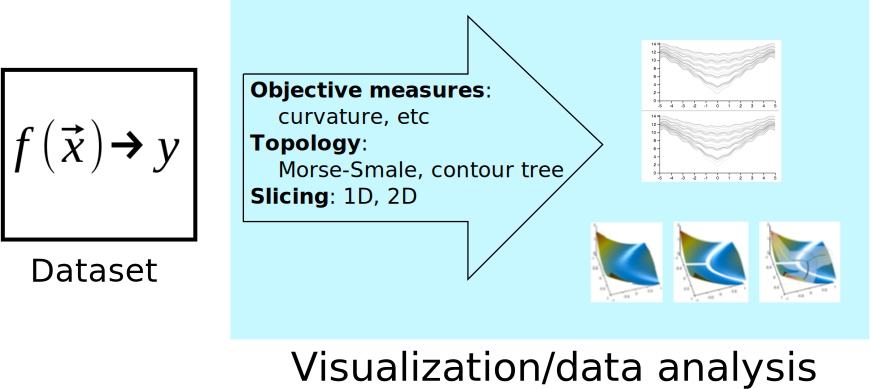

## Visualization pipelines

**Discrete**

{height=250px}

. . .

**Continuous**

{height=250px}

::: notes

* **"Standard"**
    1. Regression model
    2. Discretization
    3. Data table
    4. Use discrete visualization techniques
* **Proposed**
    1. Regression model
    2. Data is the function
    3. Continuous visualization/analysis

* Issues:
    - discrete version can throw away information that may be needed for later (median example)
    - Sampling might not be sufficient for visualization

:::

## Agenda

Benefits of treating a regression model itself as the "dataset" for visual
data analysis

* What are regression algorithms?
* Overview of slicing
* Advantages of regression model as dataset

::: notes
In this talk I will show an alternative way of looking at how to visualize 
regression algorithms and some example benefits of this approach
:::

## What are regression models?

"predict the value of one or more *continuous* target variables given the value
of a D-dimensional vector of input variables"[@bishop:2006]

::::::::: {.columns}
::: {.column width="60%"}

* Important bits:
    - Take a number of factors as input (often continuous)
    - Output is a scalar
    - Inputs are often meaningful
    - Conceptually a multi-dimensional surface (manifold)
:::
::: {.column width="40%"}

:::
:::::::::

**key issue**: how do we understand this multi-dimensional surface?

## Application areas

::::::::: {.columns}
::: {.column width=50%}
**Geostatistics**

![[@tonkin:2002]](images/geology.png){height=190px}
::: 
::: {.column width=50%}
**Urban studies**

![[@shairsingh:2019]](images/urban.jpg){height=190px}
:::
::: {.column width=50%}
**Finance**

![[@anghelache:2014]](images/finance.png){height=190px}
:::
::: {.column width=50%}
**Epidemiology**

![[@pittavino:2017]](images/epidemiology_bn.jpg){height=190px}
:::
:::::::::

## Slicing

:::::::::::: {.columns}
::: {.column width=40%}

:::
::: {.column width=60%}
* **Pros**
    - Reduces dimensionality
    - Easy to understand metaphor

* **Cons**
    - Focus point selection important
:::
:::::::::::: 

## Multi-D slicing

<svg viewBox="0 0 400 300">
  <svg data-fragment-index="1" viewBox="0 0 400 300">
    <use xlink:href="images/slicing_diagram.svg#layer1">
  </svg>
  <svg class="fragment" data-fragment-index="2" viewBox="0 0 400 300">
    <use xlink:href="images/slicing_diagram.svg#layer4">
  </svg>
  <svg class="fragment" data-fragment-index="3" viewBox="0 0 400 300">
    <use xlink:href="images/slicing_diagram.svg#layer2">
  </svg>
  <svg class="fragment" data-fragment-index="4" viewBox="0 0 400 300">
    <use xlink:href="images/slicing_diagram.svg#layer3">
  </svg>
</svg>

## Slicing

::::::::: {.columns}
::: {.column width=50%}
**1D**

![Sliceplorer[@torsney-weir:2017a]](images/distribution_sp.png){height=450px}
:::
::: {.column width=50%}
**2D**

![Hyperslice[@vanwijk:1993]](images/distribution_hs.png){height=450px}
:::
:::::::::

## Benefits of pipeline

{height=250px}

* Fast rendering
* Focus point selection

## Fast rendering

Because we know the details of the model, the visualization system can execute
the regression model at any point

::::::::: {.columns}
::: {.column width=50%}
**3 fps**

{data-autoplay=true loop=true}
:::
::: {.column width=50%}
**30 fps**

{data-autoplay=true loop=true}
:::
::::::::: 

::: notes
What's cool about tuner is that since we had access to the definition of the
regression function, we could write a custom renderer for the hyperslice view
using OpenGL that rendered faster and every pixel was calculated
:::

## Fast rendering

Knowing we were using Gaussian process models, we could analyze the geometry of the
scene to figure out how to make it run faster

::::::::: {.columns}
::: {.column width=50%}

:::
::: {.column width=50%}

:::
:::::::::

## Fast rendering

{height=200px}

![[@torsney-weir:2017]](images/timing_prediction.png){height=400px}

## Focus point selection

![Focus point sampling using space-filling design[@torsney-weir:2017a]](images/sample_slicing.png)

::: notes
Sampling is done using a space filling design 

So each line in a subplot corresponds to a single focus point. The advantage
is that the user doesn't need to navigate to get an overview
:::

## Conclusion

Treating the regression model itself as the datatype allows us to analyze 
the model more efficiently.

* Slice-based visualization
* Efficient rendering
* Control of sampling

## Thanks!

**Questions?**

t.d.torsney-weir@swansea.ac.uk

{height=200px}

## References

